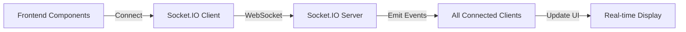

# Real-Time Live Score System

## Overview
This cricket scoring system uses **WebSocket (Socket.IO)** for real-time updates across all components.

## Architecture

### Backend (Socket.IO Server)
**Location:** `backend/server.js`

The backend emits the following events:

1. **`ballUpdate`** - Emitted when a ball is added to a live match
   ```javascript
   io.emit('ballUpdate', {
     matchId: match.matchId,
     match: match,
     ball: ball,
     commentary: commentaryText
   });
   ```

2. **`matchStarted`** - Emitted when a match begins
   ```javascript
   io.emit('matchStarted', match);
   ```

3. **`matchEnded`** - Emitted when a match completes
   ```javascript
   io.emit('matchEnded', {
     matchId: match.matchId,
     match: match,
     winner: match.result.winner,
     winBy: match.result.winBy
   });
   ```

4. **`scoreUpdate`** - Emitted when match details are updated
   ```javascript
   io.emit('scoreUpdate', {
     matchId: match.matchId,
     match: match
   });
   ```

### Frontend (Socket.IO Client)
**Location:** `src/lib/socket.ts`

The `SocketService` class provides:
- Connection management
- Event listeners (onBallUpdate, onMatchStarted, onMatchEnded, onScoreUpdate)
- Room joining/leaving for specific matches

## Real-Time Components

### 1. LiveScoringAdmin (`src/components/admin/LiveScoringAdmin.tsx`)
**Purpose:** Admin dashboard for live scoring

**Features:**
- ✅ Real-time ball updates
- ✅ Instant score refresh when adding balls
- ✅ Socket connection status indicator
- ✅ Toast notifications for updates

**WebSocket Integration:**
```typescript
socketService.onBallUpdate((data) => {
  // Update selected match immediately
  setSelectedMatch(data.match);
  // Update matches list
  setMatches(prev => prev.map(m => m.matchId === data.matchId ? data.match : m));
  // Show notification
  toast({ title: "Live Update!", description: data.commentary });
});
```

### 2. LiveScores Page (`src/pages/LiveScores.tsx`)
**Purpose:** Public live scores display

**Features:**
- ✅ Real-time score updates
- ✅ Live commentary feed
- ✅ Current batsmen stats
- ✅ Connection status indicator
- ✅ Last update timestamp

**WebSocket Integration:**
```typescript
socketService.onBallUpdate((data) => {
  setLiveMatches(prev => {
    const index = prev.findIndex(m => m.matchId === data.matchId);
    if (index !== -1) {
      const updated = [...prev];
      updated[index] = data.match;
      return updated;
    }
    return prev;
  });
});
```

### 3. Native PiP Scores (`src/components/NativePiPScores.tsx`)
**Purpose:** Floating picture-in-picture live scores

**Features:**
- ✅ Instant canvas redraw on score updates
- ✅ Cricbuzz-style animated UI
- ✅ Pulsing LIVE indicator
- ✅ Floats across all applications (VSCode, Chrome, etc.)

**WebSocket Integration:**
```typescript
socketService.onBallUpdate((data) => {
  if (currentMatch && data.matchId === currentMatch._id) {
    setCurrentMatch(data.match);
    // Redraw canvas immediately for PiP
    if (isPiPActive) {
      drawScoreToCanvas();
    }
  }
});
```

## How It Works

### Scoring Workflow

1. **Admin adds a ball** in `LiveScoringAdmin` component
   ```
   User enters: Striker, Bowler, Runs, Extras
   ↓
   POST /api/matches/{matchId}/ball
   ```

2. **Backend processes and saves**
   ```
   Update match innings, stats, commentary
   ↓
   Save to MongoDB
   ↓
   Emit 'ballUpdate' via Socket.IO
   ```

3. **All connected clients receive update instantly**
   ```
   LiveScoringAdmin → Updates admin view
   LiveScores Page → Updates public display
   NativePiP → Redraws canvas with new score
   ```

### Connection Flow



## Setup Instructions

### 1. Start Backend Server
```bash
cd backend
npm start
```
- Server runs on `http://localhost:5001`
- Socket.IO enabled automatically

### 2. Start Frontend
```bash
npm run dev
```
- Frontend runs on `http://localhost:5173`
- Automatically connects to Socket.IO server

### 3. Test Real-Time Updates

**Option A: Admin Dashboard**
1. Go to `/admindashboard`
2. Select "Live Scoring" tab
3. Start a match or select existing live match
4. Add balls and watch updates

**Option B: Public Live Scores**
1. Open `/live-scores` in one browser tab
2. Open `/admindashboard` in another tab
3. Add a ball in admin
4. See instant update in live scores page

**Option C: Native PiP**
1. Ensure a live match exists
2. Permission dialog appears automatically
3. Click "Enable Float"
4. Add balls in admin
5. Watch PiP update in real-time across all apps

## Environment Variables

**Backend** (`.env`):
```env
PORT=5001
MONGODB_URI=your_mongodb_connection_string
```

**Frontend** (`.env`):
```env
VITE_API_BASE_URL=http://localhost:5001
```

## Benefits of WebSocket Approach

✅ **Instant Updates** - No polling delay, updates appear immediately
✅ **Efficient** - Single connection, multiple events
✅ **Scalable** - Can handle thousands of concurrent viewers
✅ **Reliable** - Automatic reconnection on disconnect
✅ **Low Latency** - Typical latency < 100ms
✅ **Battery Friendly** - No continuous HTTP polling

## Debugging

### Check Socket Connection
```javascript
// In browser console
socketService.getSocket()?.connected  // Should be true
```

### View Socket Events
```javascript
// Backend logs
✅ Server running on port 5001
🔄 Socket.IO enabled for real-time updates
✅ Client connected: socket_id_here
📡 Client socket_id joined match room: match_M1234567890
⚡ Ball update emitted for match: M1234567890
```

### Frontend Logs
```javascript
🟢 LiveScores connected to Socket.IO
⚡ LiveScores received ball update: {matchId, match, ball, commentary}
🟢 PiP connected to Socket.IO
⚡ PiP received ball update: {...}
```

## Troubleshooting

### PiP Not Updating
1. Check Socket connection: Look for 🟢 in console
2. Verify match is live: `status: 'live'`
3. Check browser PiP support: Chrome/Edge/Safari only

### Admin Not Receiving Updates
1. Refresh page to reconnect Socket
2. Check backend is running on port 5001
3. Verify CORS settings allow connections

### Connection Drops
- Socket.IO auto-reconnects
- Fallback polling every 30 seconds
- Check network connectivity

## API Endpoints

### Start Match
```
POST /api/matches/{matchId}/start
```

### Add Ball
```
POST /api/matches/{matchId}/ball
Body: {
  runs, striker, bowler, isWicket, isWide, isNoBall, etc.
}
```

### Get Live Matches
```
GET /api/matches/live
```

## Performance

- **Socket.IO Connection**: ~5KB initial, then minimal overhead
- **Event Payload**: ~2-5KB per ball update
- **Canvas Redraw**: 30 FPS for PiP animation
- **Update Latency**: < 100ms from admin to viewers

## Future Enhancements

- [ ] Match-specific rooms for better scalability
- [ ] Compressed event payloads
- [ ] Historical playback feature
- [ ] Mobile push notifications
- [ ] Multi-language commentary
